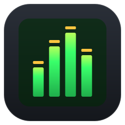
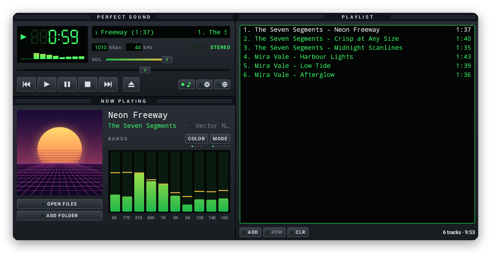
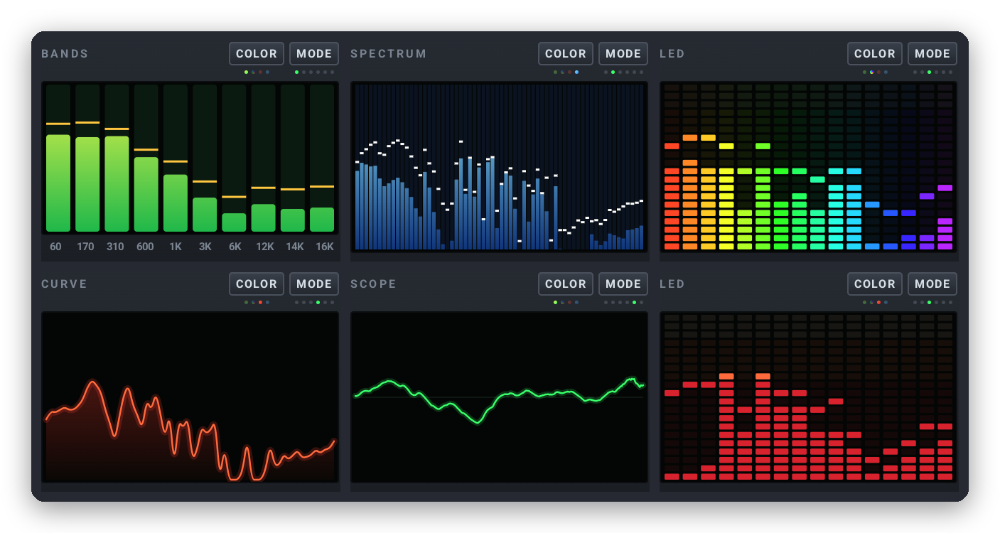
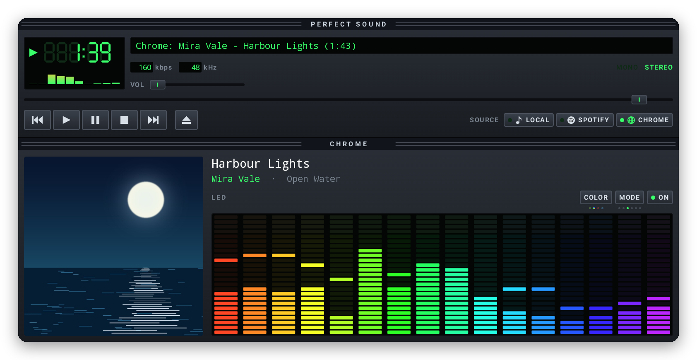

<p align="center">
  
</p>

<h1 align="center">Perfect Sound</h1>

<p align="center">
  <b>A music player for Googlebooks in the spirit of the classic '90s desktop players.</b><br>
  A seven-segment clock, a scrolling title, a live visualizer and a proper playlist, drawn crisp at
  any size. It plays your own files, and it can follow and control Spotify or a Chrome tab.
</p>

<p align="center">
  <a href="../../releases/latest/download/PerfectSound.apk"><b>⬇ Download PerfectSound.apk</b></a>
  &nbsp;·&nbsp; <a href="#install">Install</a>
  &nbsp;·&nbsp; <a href="#privacy">Privacy</a>
  &nbsp;·&nbsp; <a href="CHANGELOG.md">What's new</a>
  &nbsp;·&nbsp; <a href="#licenses">Licenses</a>
</p>

<p align="center">
  
  
  
  
  
</p>

<p align="center"><sub>A personal passion project by <a href="https://github.com/sanjaynathwani-blip">sanjaynathwani-blip</a>, proudly developed entirely on a Googlebook.
Not affiliated with or endorsed by any employer, or by Winamp, Spotify or Google (<a href="#about-this-project">more</a>).</sub></p>

<p align="center">
  
</p>

## What it is

Perfect Sound is a free, open-source music player that brings back the feel of the desktop
players of the late '90s: a dark panel with an LCD clock, a title that scrolls, bars that bounce to
the music and a playlist you drive with the keyboard. It's built from scratch for Android with
Kotlin and Jetpack Compose, and everything is vector graphics, so it stays sharp at the
Googlebook's display scaling and at any window size.

- **Your own music:** MP3, FLAC, AAC, Ogg, Opus, WAV and more, with gapless playback, a media
  notification, lock-screen and media-key controls, and it picks up where you left off.
- **A visualizer** with six modes and four colour themes (below).
- **Remote mode** for **Spotify** and **Chrome**: see and control what they're playing, with the
  visualizer bouncing to them too.
- **A real playlist:** add files or whole folders, drop files onto the window or use **Open with**
  from Files; select with Ctrl and Shift, drag to reorder, right-click for more.
- **The classic keyboard shortcuts:** Z X C V B for the transport, and the rest below.

## The visualizer

<p align="center">
  
  <br><sub>BANDS, SPECTRUM, LED, CURVE and SCOPE, in the green, ice, rainbow and red themes. A sixth mode, VU METER, draws a pair of tape-deck needle meters.</sub>
</p>

**MODE** cycles the six modes (or click the display) and **COLOR** cycles the themes; small dots
under each button show where you are, and Perfect Sound remembers both. For your own files the
visualizer needs no permissions at all.

## Remote mode: Spotify and Chrome

<p align="center">
  
  <br><sub>Following a Chrome tab: the title, artist, album art and position come from Chrome's media session.</sub>
</p>

Pick **SPOTIFY** or **CHROME** next to the transport buttons and Perfect Sound opens that app,
so you can start something, then shows and controls it: play, pause, skip, seek, the volume, and
shuffle and repeat where Spotify allows them. The audio stays in Spotify or Chrome; Chrome covers
anything a tab plays, such as YouTube Music on the web.

To make the visualizer bounce to them, press **ON**: Android asks to share an app's audio each
time, and Perfect Sound only ever captures other apps' media playback, never the microphone.

## Made for the Googlebook

- **A desktop window:** it resizes freely, and when there's room the playlist moves beside the
  player. The source buttons shrink to icons when the player is narrow.
- **Right-click menus** on the player and the playlist, **multi-select** with Ctrl and Shift,
  **drag to reorder**, and **drop files** from the Files app straight onto the window.
- **Open with Perfect Sound** from Files or Chrome's downloads.
- **Keyboard first:**

| Keys | Action |
| --- | --- |
| Z / X / C / V / B | Previous / Play / Pause / Stop / Next |
| Space | Pause / resume |
| ← / → | Seek 5 seconds |
| ↑ / ↓ | Volume (in the playlist: move the selection) |
| L / Shift+L | Open files / Add folder |
| S / R | Shuffle / Repeat |
| Alt+G / Alt+E | Show the visualizer / playlist |
| Enter / Delete / Ctrl+A | Play / Remove / Select all (in the playlist) |

## Install

Perfect Sound isn't in a store; you install the APK from this page. It takes a minute:

1. On your Googlebook (or any Android 10+ device), download
   **[PerfectSound.apk](../../releases/latest/download/PerfectSound.apk)**.
2. Open it: click the download in Chrome, or find **PerfectSound.apk** in the **Files** app under
   Downloads.
3. The first time, Android asks whether Chrome (or Files) may install apps: choose **Settings**,
   turn on **Allow from this source**, go back and click **Install**.
4. Open **Perfect Sound** from the launcher and click **OPEN FILES** or **ADD FOLDER**, or pick
   **SPOTIFY** or **CHROME**.

**Updating:** download the new PerfectSound.apk and install it over the old one; your playlist and
settings stay. Every release is signed with the same key, and Android refuses an update signed with
another, so only install Perfect Sound from this page.

**Checking the download** (optional): each release lists SHA-256 checksums in `SHA256SUMS`; in the
Googlebook's Linux Terminal, `sha256sum PerfectSound.apk` prints the one to compare.

## Privacy

- **No internet permission.** Perfect Sound can't send anything anywhere, and it has no accounts,
  analytics or ads.
- **Your files only through you.** It sees the files and folders you pick or drop on it, and
  nothing else of your storage.
- Every permission is optional and asked for only when you use the feature that needs it:

| Permission | Why |
| --- | --- |
| Notifications | The media controls while music plays in the background |
| Notification access | Android's way of letting an app see and control Spotify's and Chrome's media sessions; used for nothing else |
| Record audio, and the share prompt | Android's way of letting an app hear other apps' playback for the visualizer in remote mode. Only media playback is captured, never the microphone, and nothing is recorded or kept |

Uninstalling Perfect Sound removes everything it stored.

## To do

- [ ] **Screen readers:** label the drawn controls for TalkBack.
- [ ] **Ideas under consideration:** a media library to browse by artist and album, saved
  playlists, and lyrics.

Ideas and bug reports are welcome in [Issues](../../issues).

## How it's built

Perfect Sound is plain Android: Kotlin, Jetpack Compose for every pixel of the interface (the
seven-segment digits, the sliders and the meters are all drawn in code), and AndroidX Media3 for
playback and the media session. Remote mode uses Android's media sessions and notification-listener
API; the remote visualizer uses `AudioPlaybackCapture`. The app lives in [`app/`](app/).

```sh
./gradlew assembleDebug          # app/build/outputs/apk/debug/app-debug.apk ("Perfect Sound Dev")
./gradlew testDebugUnitTest      # unit tests
./gradlew assembleRelease        # signed only if ~/.config/perfect-sound/keystore.properties exists
```

It needs JDK 17 and the Android SDK (platform 35). The debug build installs next to the release
one, as **Perfect Sound Dev**.

## Made on a Googlebook

Perfect Sound was made entirely on a Googlebook, in its built-in Linux Terminal:

- The Terminal's Debian VM runs Gradle and the Android SDK, building and signing the APK.
- The app goes straight onto the same laptop over Wireless debugging, where every change is tried
  for real and checked with `adb` screenshots.
- The music in these screenshots is made up and made by code: [`tools/demo_music.py`](tools/demo_music.py)
  synthesizes the tracks and paints their cover art, and
  [`tools/readme_images.py`](tools/readme_images.py) turns window captures into the images on this
  page. The logo is [`brand/perfect-sound-logo.svg`](brand/perfect-sound-logo.svg).

## About this project

Perfect Sound is my personal passion project, made by me,
[sanjaynathwani-blip](https://github.com/sanjaynathwani-blip), in my own time. It has no
affiliation with my employer: my employer didn't make, sponsor, review or endorse it, and nothing
here speaks for my employer or endorses its products.

It's inspired by the desktop music players of the late '90s but shares no code or artwork with
any of them. Winamp is a trademark of its owners, Spotify is a trademark of Spotify AB, and Chrome
and Googlebook are trademarks of Google LLC; they're named only to describe what Perfect Sound
works with, and none of them made or endorsed it.

## Licenses

- **Perfect Sound's own code**, the logo, the tools and the demo music are under the
  [MIT License](LICENSE).
- The libraries built into the app (AndroidX Media3, Jetpack Compose, AndroidX, the Kotlin
  standard library, kotlinx.coroutines and Guava) are under the **Apache License 2.0**.

[`THIRD_PARTY_NOTICES.md`](THIRD_PARTY_NOTICES.md) lists every component inside the app, and
[`licenses/`](licenses/) holds the license text.

<p align="center"><sub>With a little help from Claude.</sub></p>
